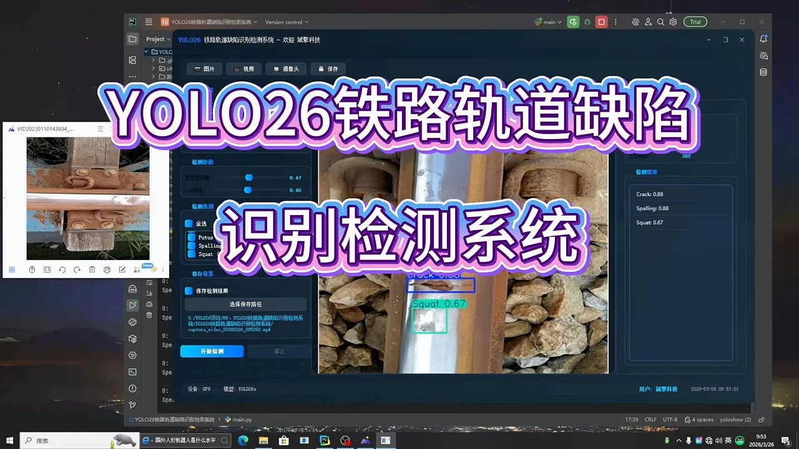
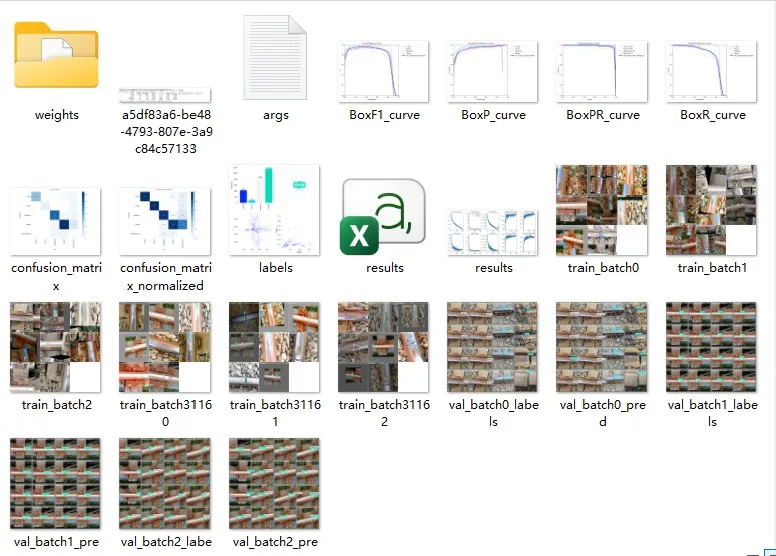
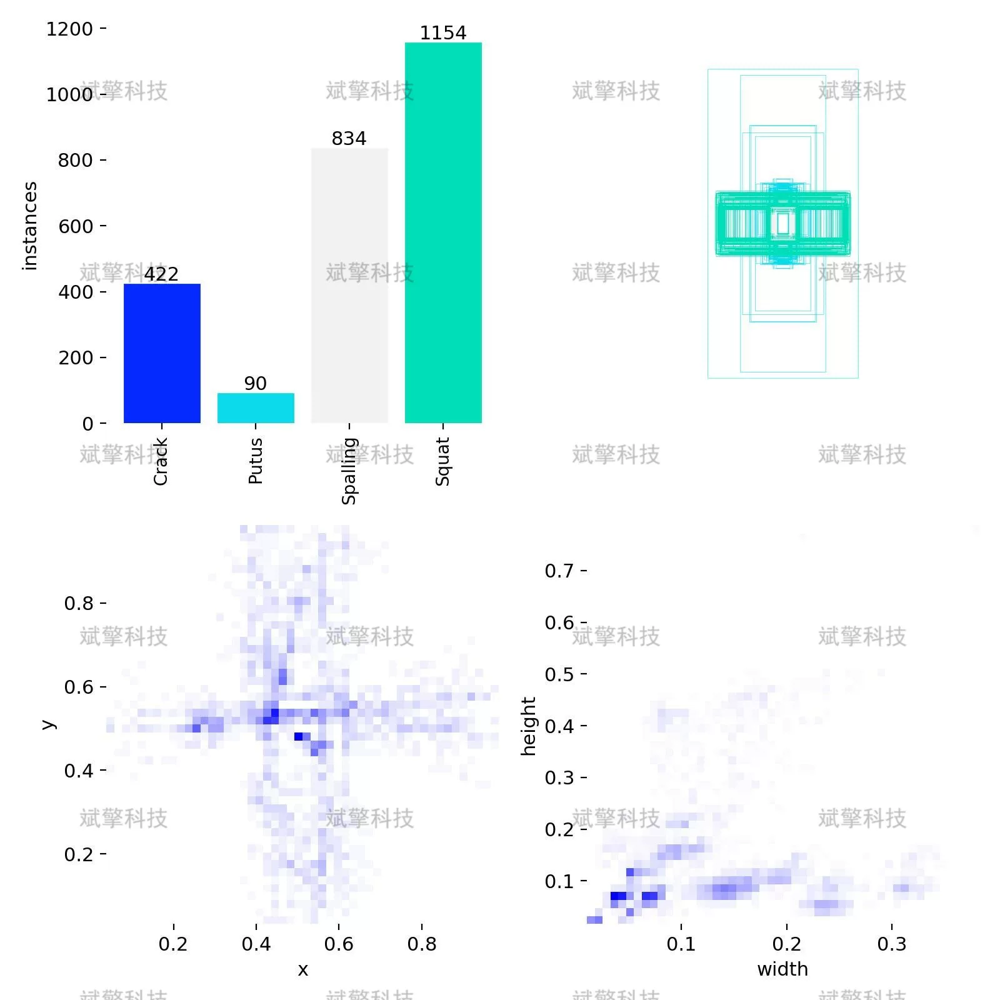
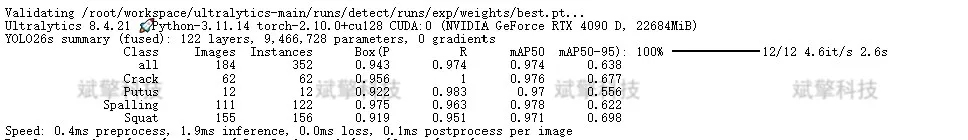
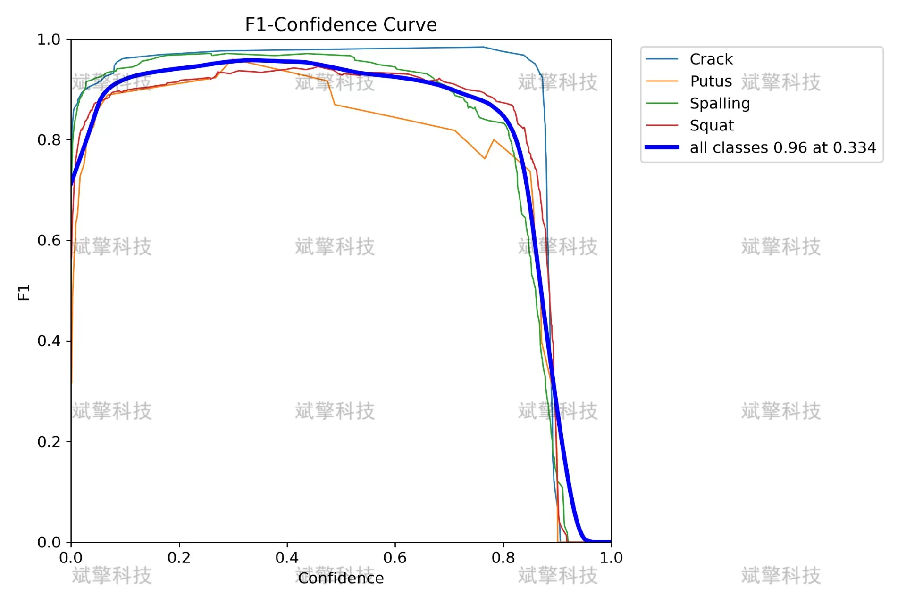
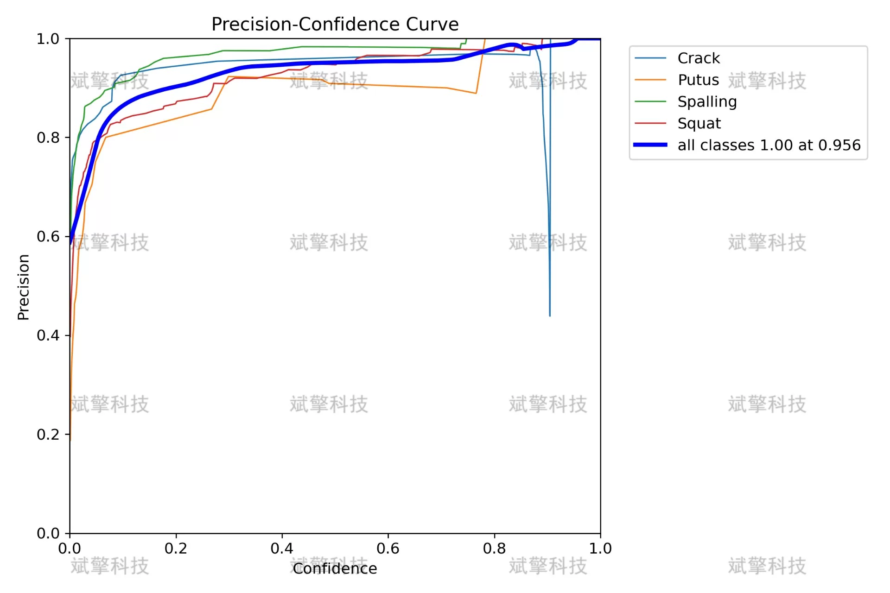
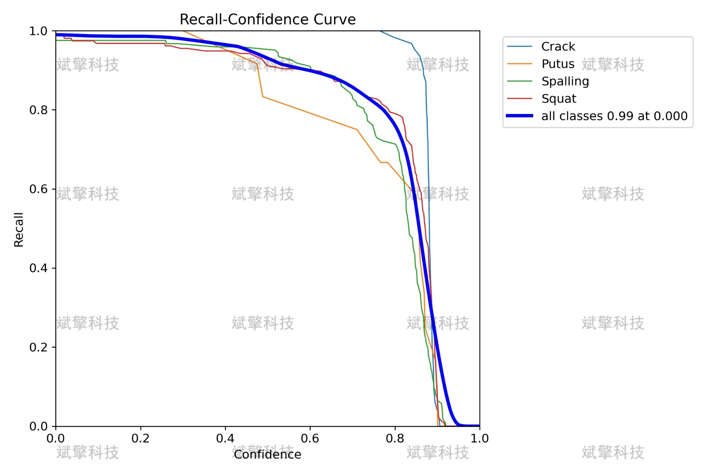
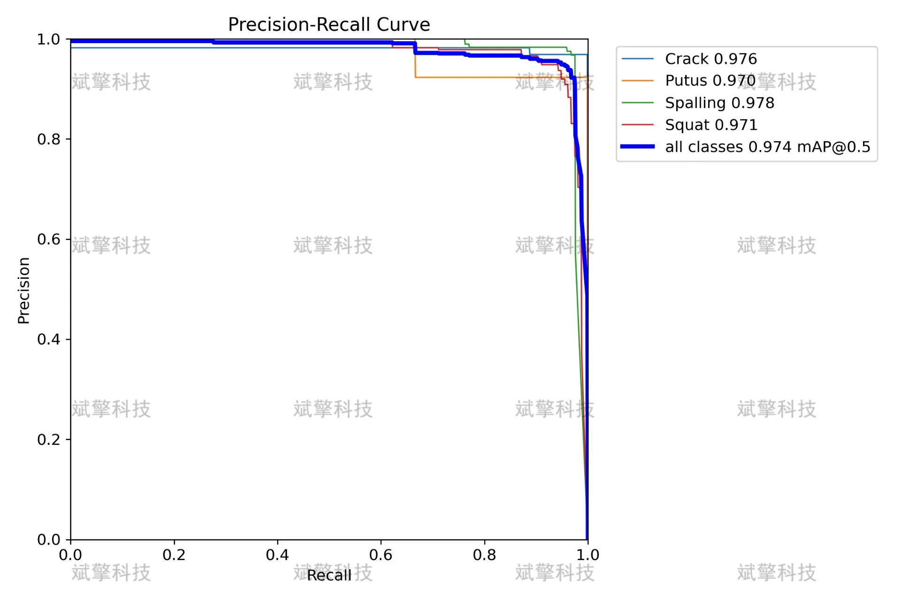
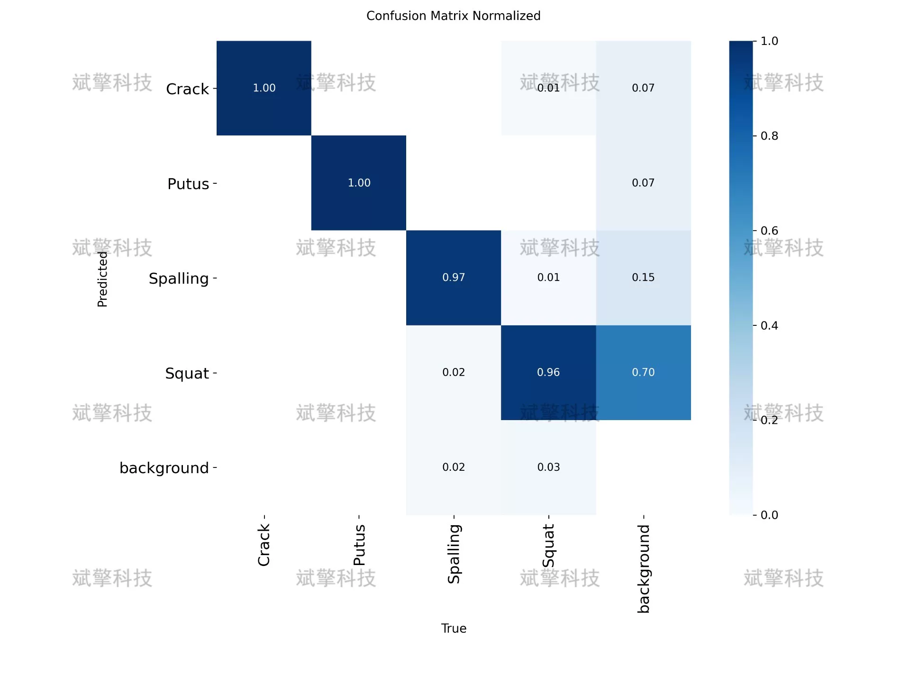

# YOLO26 Railway Track Defect Detection System | Source Code

## Body

YOLO26 Railway Track Defect Detection System | Source Code: A New Breakthrough in Railway Track Defect Detection with YOLO26: Applications in Crack, Pull-out, Spalling, and Squatting Detection

Railway track defect detection is a key aspect of ensuring railway transportation safety. Traditional manual inspection methods are inefficient and susceptible to subjective factors, failing to meet the modern requirements for railway operation and maintenance. This paper builds an automatic recognition detection system for four common rail track defects (Crack, Pull-out, Spalling, Squat) based on the YOLO26 object detection algorithm. The system employs the YOLO26 architecture, training, validating, and testing with 1593 labeled images, including 1312 training images, 184 validation images, and 97 test images. Experimental results show that the model achieves an mAP50 of 0.974 and an mAP50-95 of 0.638 on the validation set, with detection accuracy for all categories exceeding 0.95. This system effectively identifies surface defects on railway tracks, providing reliable technical support for the intelligent operation and maintenance of railway infrastructure.

The system detects the four common types of rail track surface defects as follows:
Crack (Crack): Line-shaped cracks appearing on the rail surface, often caused by fatigue loads or temperature stresses, representing the primary manifestation of early rail damage.
Pull-out (Pulling-out): Complete or partial disconnection of the rail structure, considered a severe defect, often triggered by crack expansion or sudden external forces.
Spalling (Spalling): Localized sheet-like material loss on the rail surface, characterized by local depressions or pits, often caused by contact fatigue or material defects.
Squat (Squatting): Localized sinking or crushing of the rail surface, typically associated with plastic deformation at the head section of the rail due to frequent heavy vehicle passage.

Dataset Size and Division
The dataset used in this system consists of 1593 labeled images, divided as follows:
Training set: 1312 images, accounting for 82.4% of the total samples, used for model training and parameter optimization.
Validation set: 184 images, accounting for 11.5% of the total samples, used for model performance evaluation and hyperparameter tuning.
Test set: 97 images, accounting for 6.1% of the total samples, used for independent testing of the final model performance.

Free reservation for remote installation. Unsuccessful installation will result in a full refund.
Purchase includes the following resources (accessed via Baidu Cloud):
- Full source code for YOLO recognition detection project
- YOLO format datasets
- Training code + UI interface code
- Trained model + result images
- Software installation package
- Add WeChat to schedule remote installation (automatically displayed after purchase) - Unsuccessful, full refund guaranteed

⚙️ Core Function Modules
Detection Capability
- Image detection: Upon upload, returns detection boxes + category information
- Video detection: Supports video files, analyzes frames accurately
- Camera real-time detection: Integrated with USB cameras for dynamic monitoring
Interaction and Control
- Target filtering: Choose one or more categories for detection
- Parameter adjustment: Adjustable confidence threshold & IoU threshold, flexible control over precision
- Results saving: Save images/videos/camera detection results in one click
System and Data
- User login registration: Supports password strength checking + encryption storage
- Log recording: Records operation and error information automatically (timestamped)

## Images

## Payment

Here is a pay link on Stripe ( https://buy.stripe.com/3cs8yP7sY87d0vu9AB ). Please contact me lonlonago@foxmail.com after funding $89, and I will send you a complete data files , thank you!

